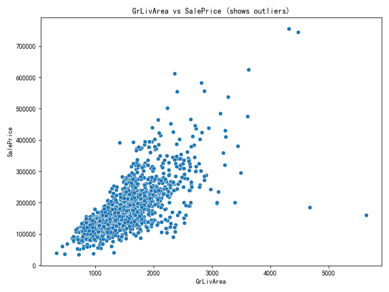

# 房屋价格预测高级机器学习流水线

这是一个端到端的机器学习回归项目，旨在基于一系列房屋特征，精确预测其最终销售价格。项目集成了一套完整、健壮且可复现的机器学习工作流。

[](https://www.python.org/)
[](https://opensource.org/licenses/MIT)

---

## ✨ 项目特性

- **端到端工作流**: 从数据探索到最终预测的完整自动化流水线。
- **自动化探索性数据分析 (EDA)**: 运行主程序时，自动生成并保存所有关键数据分析图表。
- **高级特征工程**: 自动创建数十个有业务意义的特征，如房屋总面积、房龄等。
- **多模型训练**: 并行训练多种业界领先的模型 (XGBoost, LightGBM, CatBoost, TabNet)。
- **双重融合策略**:
    - **加权平均**: 根据模型在交叉验证中的表现智能分配权重。
    - **堆叠泛化 (Stacking)**: 训练一个元模型 (`LassoCV`) 来学习如何最佳地组合基模型的预测。
- **自动化实验跟踪**: 每次运行的结果（配置、模型、预测、报告）都保存在以时间戳命名的独立目录中，便于追溯和比较。
- **一键生成性能报告**: 实验结束后，自动生成一份图文并茂的Markdown性能报告。

---

## 📂 项目结构

```
.
├── data/                     # 存放原始数据 (train.csv, test.csv)
├── experiments/
│   ├── eda_plots/            # 存放探索性数据分析的图表
│   └── 20231027_120000/      # 一次具体实验的输出目录
│       ├── models/           # 保存的模型文件
│       ├── predictions/      # 保存的预测结果文件
│       └── performance_report/ # 生成的性能报告
├── .gitignore                # Git忽略文件配置
├── eda_analysis.py           # EDA图表生成脚本
├── ensemble.py               # 模型融合逻辑
├── experiment_report_generator.py # 自动化报告生成器
├── feature_engineering.py    # 特征工程脚本
├── main.py                   # 主程序入口
├── model_evaluation.py       # 模型评估函数
├── model_training.py         # 模型训练逻辑
├── data_preprocessing.py     # 数据预处理脚本
├── README.md                 # 项目说明
└── requirements.txt          # Python依赖
```

---

## 🚀 开始使用

### 1. 环境配置

- **克隆仓库**:
  ```bash
  git clone <your-repository-url>
  cd <repository-name>
  ```

- **创建并激活虚拟环境** (推荐):
  ```bash
  python -m venv venv
  # Windows
  .\venv\Scripts\activate
  # macOS / Linux
  source venv/bin/activate
  ```

- **安装依赖**:
  ```bash
  pip install -r requirements.txt
  ```

### 2. 准备数据

请将比赛提供的 `train.csv` 和 `test.csv` 文件放入项目根目录下的 `data/` 文件夹中。

### 3. 运行流水线

执行以下命令即可启动完整的端到端流水线：

```bash
python main.py
```

程序将会依次执行：
1.  探索性数据分析（仅在首次运行时生成图表）。
2.  数据预处理与特征工程。
3.  训练所有基模型。
4.  执行加权平均和Stacking融合。
5.  在对应的实验目录下生成所有结果和一份性能报告。

---

## 🛠️ 技术细节

### 探索性数据分析 (EDA)

通过对数据的深入分析，我们获得了关键洞察，这些洞察直接指导了后续的决策。

- **目标变量分析**: 原始房价 `SalePrice` 呈现严重右偏，通过 `log(1+x)` 转换后，其分布接近完美正态分布，极大地提升了模型的稳定性和精度。

  

- **异常值与关键特征**: `GrLivArea` (地上生活面积) 与房价散点图揭示了两个面积巨大但价格异常低的点，我们在预处理阶段将其移除。同时，`OverallQual` (总体质量) 是影响房价的最关键特征。

   

### 模型融合策略

- **加权平均**: 根据每个模型在交叉验证中的RMSE计算权重 (`1/RMSE^2`)，简单高效。
- **堆叠泛化 (Stacking)**: 我们使用基模型在交叉验证中的折外预测（Out-of-Fold Predictions）作为训练集，来训练一个 `LassoCV` 元模型。`LassoCV` 通过L1正则化，能够自动为表现不佳或冗余的基模型赋予较低的权重，实现更智能的模型组合。整个过程在对数尺度上进行，保证了数据一致性，解决了模型权重无法学习的问题。

---
*此README由AI辅助生成和完善。* 