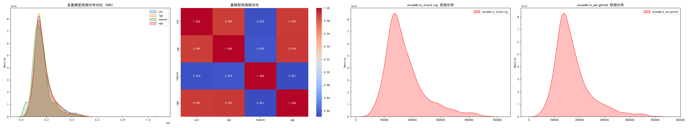

# 模型性能评估报告

## 🎯 实验信息
- **实验目录**: `experiments/20250610_200433`
- **模型数量**: 4
- **预测样本数**: 1459

## 📊 模型预测统计
| 模型                |     均值 |    中位数 |   标准差 |   最小值 |     最大值 |    偏度 |
|:------------------|-------:|-------:|------:|------:|--------:|------:|
| cat               | 176838 | 156654 | 74237 | 50897 |  550227 | 1.53  |
| lgb               | 174812 | 155236 | 72304 | 52435 |  524129 | 1.562 |
| tabnet            | 155081 | 144201 | 71885 | 25017 | 1065823 | 2.427 |
| xgb               | 173668 | 154219 | 75938 | 41322 |  518959 | 1.53  |
| ensemble_stacking | 173385 | 153525 | 69363 | 56858 |  471769 | 1.41  |
| ensemble_weighted | 173301 | 154014 | 72502 | 47326 |  521371 | 1.523 |

## 🎉 结论
- **最终融合方法**: `ensemble_stacking`
- **预测范围**: `$56,858 - $471,769`
- **平均预测价格**: `$173,385`

## 📈 可视化分析

