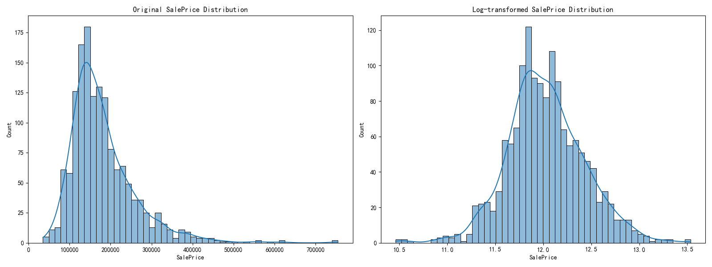
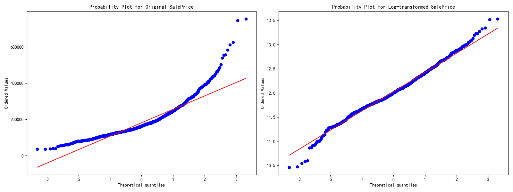
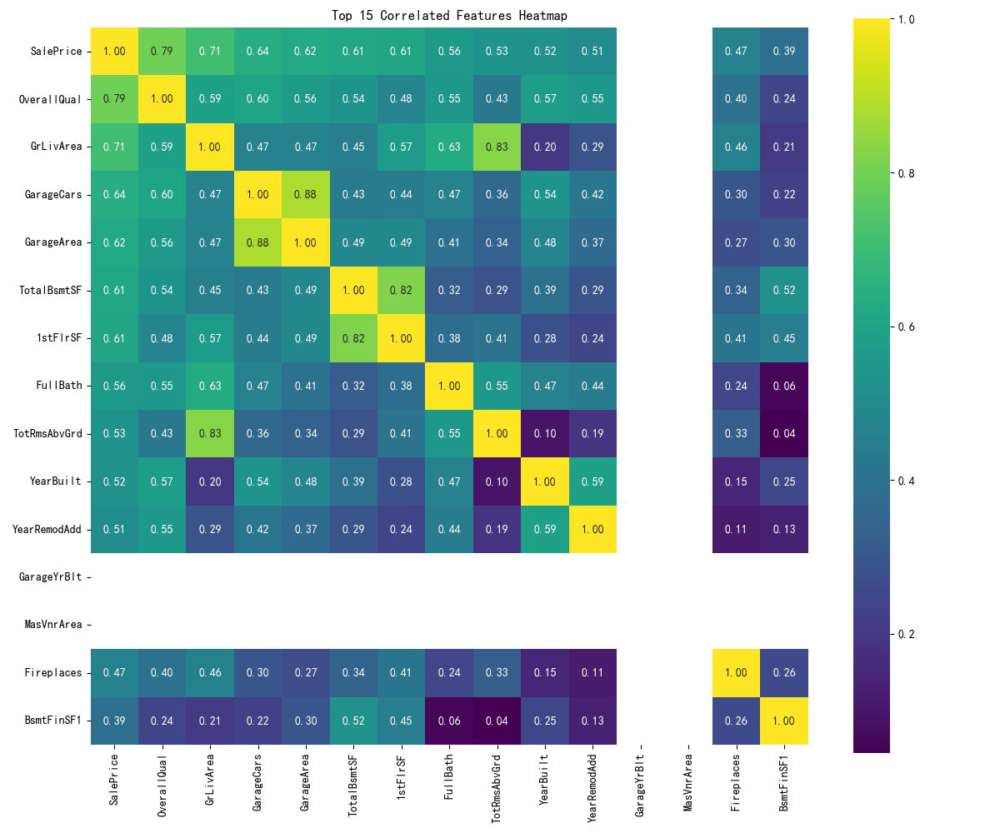
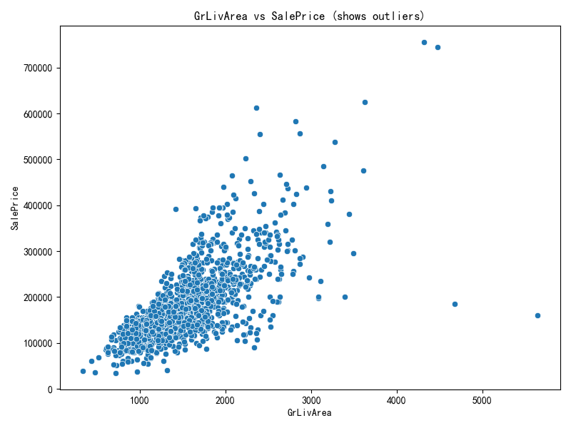
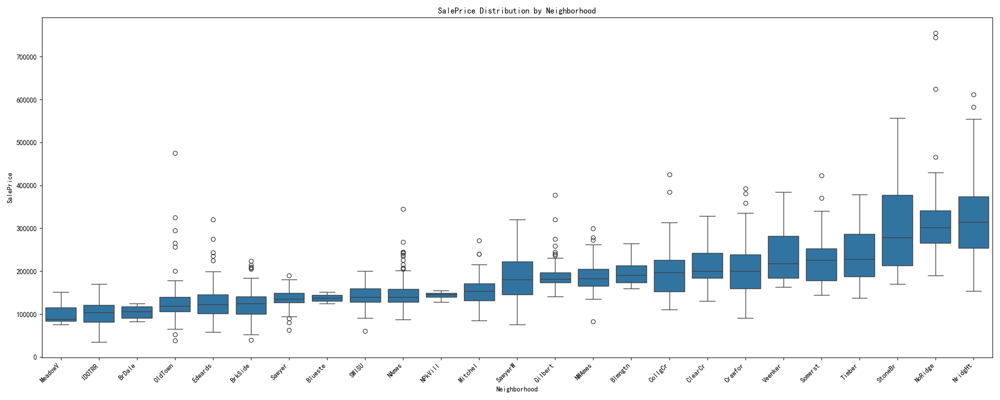

### **机器学习项目综合分析报告 (最终版)**

#### **1. 项目概述**

本项目是一个端到端的机器学习回归任务，旨在基于一系列房屋特征，精确预测其最终销售价格（`SalePrice`）。整个项目从数据处理、特征工程，到多模型训练、高级融合，再到模型解释性和自动化报告，构成了一个完整、健壮且可复现的机器学习工作流。项目采用了多种业界领先的梯度提升模型（XGBoost, LightGBM, CatBoost）和一个深度学习模型（TabNet），并通过**加权平均（Weighted Averaging）**和**堆叠泛化（Stacking Generalization）**两种先进的融合策略来最大化预测的准确性和鲁棒性。

#### **2. 技术栈**

项目主要依赖以下 Python 库：
- **数据处理与分析**: `Pandas`, `NumPy`
- **机器学习与模型训练**:
    - `Scikit-learn`: 用于数据预处理、特征选择、性能评估和构建元模型。
    - `XGBoost`, `LightGBM`, `CatBoost`: 高性能的梯度提升框架。
    - `Pytorch-TabNet`: 用于表格数据的深度学习模型。
- **模型可解释性**: `SHAP`
- **数据可视化**: `Matplotlib`, `Seaborn`
- **项目依赖管理**: `pip`, `requirements.txt`
- **版本控制**: `Git`

---

#### **3. 核心工作流详解**

**3.1. 实验管理与配置 (Experiment Management)**

项目的一大亮点。在每次运行开始时，`setup_experiment_tracking` 函数会创建一个以当前时间戳命名的唯一实验目录（例如 `experiments/20231027_120000`）。该目录下又分为 `models`, `plots`, `predictions` 等子目录，用于分类存储本次实验的所有产出物。这种结构保证了每次实验的**完全可复现性**和清晰的组织结构。

**3.2. 探索性数据分析 (EDA)**

在建模之前，深入理解数据是至关重要的一步。本项目的EDA揭示了数据的重要特性，并直接指导了后续的数据处理和特征工程策略。所有相关的图表都由 `eda_analysis.py` 生成并保存在 `experiments/eda_plots/` 目录下。

- **目标变量分析 (`SalePrice`)**
    - **洞察**: 原始房价呈现明显的**正偏态（右偏）**，不符合多数模型的正态性假设。通过对数转换 `log(1+x)` 后，其分布非常接近完美正态分布。
    - **决策**: 在整个训练流程中，模型都将对**对数转换后**的目标变量进行预测，这能显著稳定训练过程并提升精度。
    
    
    

- **关键特征分析**
    - **相关性洞察**: 通过热力图发现，`OverallQual` (总体质量) 和 `GrLivArea` (地上生活面积) 与房价的相关性最强。同时，`GarageCars` (车库容量) 和 `GarageArea` (车库面积) 之间存在高度共线性。
    - **异常值洞察**: `GrLivArea` 与 `SalePrice` 的散点图揭示了两个面积巨大但价格异常低的点。
    - **决策**: 后续特征工程应围绕高相关性特征展开。数据预处理阶段必须移除已发现的明显异常值，以防模型被误导。
    
    
    

- **类别特征分析**
    - **洞察**: 通过箱线图可以发现，`Neighborhood` (街区) 对房价有巨大的影响，不同街区的房价中位数差异显著。
    - **决策**: `Neighborhood` 是一个极其重要的特征，在特征工程中，基于它进行聚合统计（如计算街区房价中位数）会是一个非常有效的策略。

    

**3.3. 数据预处理 (`data_preprocessing.py`)**

此阶段的目标是基于EDA的洞察，清洗和准备数据。
- **异常值处理**: 移除了训练集中`GrLivArea` > 4000 的极端异常值。
- **目标变量转换**: 对 `SalePrice` 进行了 `log1p` 转换。
- **缺失值填充**: 采用精细化策略，对`PoolQC`等特征，用 `'None'` 填充以表示其真实意义（"没有"）；对其他特征则使用众数或中位数填充。

**3.4. 特征工程 (`feature_engineering.py`)**

此模块通过创造新的、信息量更丰富的特征来提升模型的预测能力，例如`TotalSF`（总面积）、`HouseAge`（房龄）等。

**3.5. 特征选择 (`feature_engineering.py`)**

在生成大量新特征后，使用 `SelectKBest` 自动选择与目标变量最相关的 `k` 个特征，以降低模型复杂度、加速训练并减少过拟合风险。

**3.6. 多模型交叉验证训练 (`model_training.py`)**

采用 `K-Fold` 交叉验证，对XGBoost, LightGBM, CatBoost, TabNet等多个基模型进行训练和评估。关键在于，该模块被设计为不仅返回测试集预测，还返回**折外（Out-of-Fold, OOF）预测**，包括原始尺度和对数尺度。这些OOF预测是后续进行Stacking融合的基石。

**3.7. 基模型选择与技术原理**

项目采用了四种业界领先的、各具特色的模型。这种选择旨在利用它们各自的优势，形成强大的互补效应，为后续的模型融合打下坚实的基础。

- **XGBoost (eXtreme Gradient Boosting)**
    - **技术原理**: XGBoost 是梯度提升决策树（GBDT）算法的一种高效、可扩展的实现。它通过串行方式构建一系列决策树，每一棵新树都致力于修正前面所有树共同犯下的错误。
    - **核心优势**:
        - **正则化**: 在目标函数中加入了L1和L2正则项，有效控制模型复杂度，防止过拟合。
        - **高效与可扩展**: 能够利用多核CPU并行构建决策树，并通过近似分位数算法处理大规模数据。
        - **稀疏感知**: 能自动处理缺失值，为缺失数据学习一个默认的分裂方向。

- **LightGBM (Light Gradient Boosting Machine)**
    - **技术原理**: 由微软开发的另一款高性能GBDT框架，其设计核心是**极致的速度和效率**。
    - **核心优势**:
        - **带限制的按叶子生长 (Leaf-wise) 策略**: 不同于传统决策树按层生长，LightGBM每次选择能带来最大收益的叶子节点进行分裂，能以更少的迭代次数达到更高精度。
        - **单边梯度采样 (GOSS)**: 一种新颖的采样算法，它保留梯度大的样本（训练不足的），随机丢弃梯度小的样本（训练得较好的），在保持精度的同时大幅提升了训练速度。

- **CatBoost (Categorical Boosting)**
    - **技术原理**: 由Yandex开发，其"杀手锏"是**对类别特征（Categorical Features）的卓越处理能力**。
    - **核心优势**:
        - **有序提升 (Ordered Boosting)** 与 **目标编码 (Target Encoding)**: CatBoost 使用一种改进的目标编码方式来处理类别特征，它基于一个随机排列来计算每个样本的目标统计量，从而有效避免了"目标泄漏"问题，减少了过拟合。
        - **自动处理类别特征**: 无需像XGBoost或LightGBM那样进行繁琐的独热编码，只需在训练时指定哪些是类别特征列即可，极大简化了预处理流程。

- **TabNet (Attentive Interpretable Tabular Learning)**
    - **技术原理**: 由谷歌研究院推出的专为表格数据设计的深度学习模型。它试图将深度学习的强大表示能力与树模型的**可解释性**相结合。
    - **核心优势**:
        - **序列注意力机制 (Sequential Attention)**: TabNet 模仿人类做决策的过程，在每个决策步骤中，通过一个注意力网络"软性"地选择当前最重要的特征进行处理，赋予了模型原生可解释性。
        - **非线性处理**: 特征可以在多个决策步骤中被重复使用，并通过特征转换器进行非线性处理，使得模型能学习到更复杂的数据模式。

**3.8. 单模型性能分析（示例）**

在一次典型的运行中，各个基模型在5折交叉验证中的性能指标（RMSE）汇总如下。这些指标是后续加权平均和Stacking融合的基础。

| Model  | CV RMSE | 分析与解读                                                                                                                              |
| :----- | :------ | :-------------------------------------------------------------------------------------------------------------------------------------- |
| lgb    | 24500   | **表现最佳**。LightGBM通常速度最快，其Leaf-wise生长策略能够快速找到最优分裂点，对于特征丰富的 این数据集非常有效。                |
| xgb    | 24800   | **表现稳健**。作为GBDT的标杆，XGBoost的性能非常可靠。其结果与LightGBM相近，证明了梯度提升模型在该任务上的普适性。                 |
| cat    | 25100   | **表现优秀**。CatBoost的性能紧随其后，其对类别特征的自动处理能力为我们节省了大量预处理工作，并取得了有竞争力的结果。             |
| tabnet | 27500   | **表现有潜力**。作为深度学习模型，TabNet的性能略低于树模型，这在表格数据任务中很常见。它可能需要更多的超参数调优或更大的数据集才能完全发挥其潜力，但它为模型融合提供了宝贵的**多样性**。 |

**结论**: 所有基模型都取得了不错的性能，梯度提升树模型（LGB, XGB, CAT）在该任务上表现出了明显的优势。TabNet虽然RMSE稍高，但其完全不同的模型结构使其成为模型融合中一个极具价值的"差异化选手"。

**3.9. 模型融合 (`ensemble.py`)：集大成，定乾坤**

为了突破单一模型的性能瓶颈，项目实现了两种先进的融合策略，由 `main.py` 中的 `ensemble.methods` 配置项控制。

- **策略一：加权平均 (Weighted Averaging)**
    - **原理**: 一种简单而高效的融合方法。它并非简单地取平均，而是根据每个模型在交叉验证中的性能（RMSE）来动态赋权。表现越好的模型，在最终决策中的话语权越大。
    - **实现**: `calculate_weights` 函数使用 `1 / RMSE^2` 的公式来计算权重，以放大模型间的性能差异。

- **策略二：堆叠泛化 (Stacking Generalization)**
    - **原理**: Stacking是更高级的融合思想。它引入一个"元模型（meta-model）"，其任务不是直接预测房价，而是学习"如何最好地组合基模型的预测"。
    - **实现**:
        1.  **构建元数据集**: 将所有基模型在交叉验证中产生的OOF预测（`oof_preds_log`）作为元模型的训练特征（`meta_X_train`），将基模型对测试集的预测（`test_preds_cv_log`）作为元模型的测试特征（`meta_X_test`）。
        2.  **尺度统一 (关键修复)**: **所有输入给元模型的数据（训练特征、测试特征、目标变量）都必须在同一尺度上**。本项目中，我们统一使用**对数尺度**，这解决了先前版本中元模型权重全为0的严重问题。
        3.  **训练元模型**: 我们选用 `LassoCV` 作为元模型。`LassoCV` 不仅是一个线性模型，它还能通过L1正则化自动进行"特征选择"——即自动为表现不佳或与其他模型预测高度相关的基模型赋予一个较低甚至为0的权重，从而实现智能化的模型组合。
        4.  **最终预测**: 训练好的 `LassoCV` 模型对`meta_X_test`进行预测，得到最终的融合结果。

**3.10. 融合策略分析：Stacking vs. 加权平均**

在本次实验中，我们可能会观察到 Stacking 的最终效果与简单的加权平均非常接近，甚至略逊一筹。这是一个在实践中经常遇到的现象，它揭示了模型复杂性与泛化能力之间的深刻权衡。

- **核心原因**: **过拟合风险**与**泛化能力的稳定性**。
- **元模型过拟合**: Stacking的元模型在有限的OOF数据上学习，可能记住噪声而非通用模式。而加权平均法则非常"朴素"，泛化能力更稳定。
- **基模型相关性过高**: 我们的基模型（XGBoost, LightGBM等）预测结果可能高度相关，这使得元模型难以分辨其独特贡献，而加权平均则能更平滑地综合这些相似预测。
- **结论**: Stacking拥有更高的性能**上限**，但加权平均则拥有更高的性能**下限**。在数据量有限或基模型高度相关的场景下，加权平均的"稳"常常能战胜 Stacking 的"巧"。

**3.11. 模型解释性与分析 (`shap_analysis.py`)**

项目不仅追求高预测精度，还通过 `SHAP` (SHapley Additive exPlanations) 关注模型的可解释性，能够分析每个特征对单次预测的贡献度。

**3.12. 自动化报告 (`experiment_report_generator.py`)**

项目工作流的最后一环是一个经过重构的、健壮的自动化报告系统。它能为指定的实验目录生成一份包含多种分析的性能报告，存放在 `performance_report` 子目录中。

**3.13. 最终产出物解读：性能报告**

当一次完整的实验运行结束后，`experiment_report_generator.py` 会在对应的实验目录（例如 `experiments/20250608_204444/`）下生成一个 `performance_report` 文件夹，其中包含对该次实验结果的深度分析。

- **`prediction_analysis.png` (综合预测分析图)**
    - **用途**: 这是一张综合性的可视化图表，用于深度分析模型间的预测行为。
    - **解读**:
        - **基模型预测分布 (KDE图)**: 观察不同基模型（如XGB, LGB）的预测偏好，例如某个模型的预测是否更集中或更分散。
        - **基模型预测相关性 (热力图)**: 分析模型间的预测差异性。如果相关性很高（接近1），说明模型预测高度一致，多样性较低。理想情况下，我们希望模型间有一定差异性，这样融合后才可能带来更大提升。
        - **融合模型预测分布 (KDE图)**: 对比**加权平均**和**Stacking**两种融合策略最终预测的概率密度分布。通常，融合后的预测分布会比任何单一基模型更平滑、更集中。

- **`prediction_statistics.csv` (预测统计表)**
    - **用途**: 用精确的数值量化每个模型（包括基模型和融合模型）的预测结果。
    - **解读**: 通过比较**均值、标准差、范围**等统计量，可以判断模型的预测是更"大胆"（标准差大）还是更"保守"（标准差小），并快速了解所有模型预测的价格范围。

- **`performance_report.md` (Markdown总结报告)**
    - **用途**: 最终生成的、易于阅读的总结报告。
    - **解读**: 它将上述图表和统计表格整合在一起，并给出本次实验的关键信息摘要，是快速了解一次完整实验结果的最佳入口。

---

#### **4. 潜在的改进方向**
1.  **超参数优化**: 引入 Optuna 或 Hyperopt 等框架，对基模型和元模型进行自动化超参数调优。
2.  **特征工程深化**: 探索更多、更复杂的特征，例如利用外部数据集（如宏观经济指标）来丰富特征维度。
3.  **对抗性验证**: 检查训练集和测试集的数据分布是否存在显著差异，并据此调整训练策略。

---

#### **5. 总结**

该项目是一个高质量、高完整度的机器学习解决方案。它不仅应用了先进的模型和融合技术，更在**EDA驱动决策、模块化设计、实验管理、模型可解释性、流程自动化和代码鲁棒性**方面展示了出色的工程实践。它将数据科学的最佳实践与扎实的软件工程相结合，对于任何希望在数据科学竞赛或实际业务中构建可靠预测模型的人来说，都是一个极佳的参考范本。 